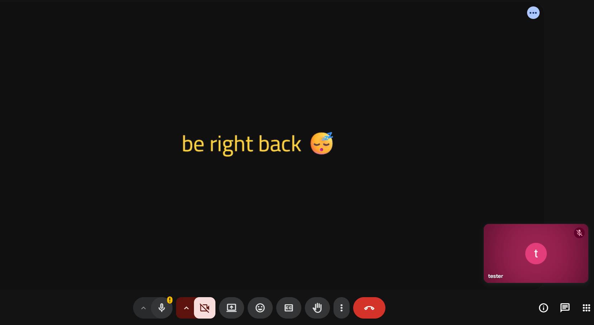
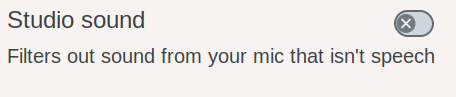
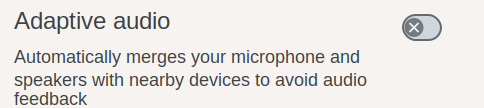

# 🎥 Camera Text Overlay

Replace your camera stream with a customizable text for video calls. Great for "be right back" messages, status indicators, or anything else you want to display on your camera!



## Features

**Use cases:** BRB messages, status cards, lobby-style hold screens — anything you want to display on your camera instead of your real feed.

**Two installation methods:** Userscript (any browser with TamperMonkey/ViolentMonkey/Greasemonkey) or Chrome Extension.

**Customizable:** text, colors, font (6 built-in), looping waiting music, microphone mute while overlay is active.

**Controls:** Userscript manager menu (userscript) or toolbar icon (extension).

**Privacy:** no network requests except Google Fonts, no tracking, settings stored locally.

## Installation

### Method 1: Userscript (recommended for simplicity)

#### Step 1: Install a Userscript Manager

Choose one of these browser extensions:

| Manager                                               | Chrome | Firefox | Edge | Opera |
| ----------------------------------------------------- | ------ | ------- | ---- | ----- |
| [**TamperMonkey**](https://www.tampermonkey.net/)     | ✅     | ✅      | ✅   | ✅    |
| [**Greasemonkey**](https://www.greasespot.net/)       | ✅     | ✅      | ✅   | ✅    |
| [**ViolentMonkey**](https://violentmonkey.github.io/) | ✅     | ✅      | ✅   | ✅    |

#### Step 2: Install the Userscript

Click this link to install:

**[📥 Install the Camera Text Overlay Userscript](https://github.com/gekkedev/camera-text-overlay/raw/main/camera-text-overlay.user.js)**

Or manually:

1. Open the [raw userscript file](https://github.com/gekkedev/camera-text-overlay/raw/main/camera-text-overlay.user.js)
2. Your userscript manager should automatically detect it
3. Click "Install" or "Confirm Installation"

#### Using the script

1. Click the **userscript manager icon** in the toolbar and open **"Camera Text Overlay"**.
2. First time: click **"⚙️ Configure Settings"**, enter your text, pick colors/font. Settings save automatically.
3. Toggle with **"🟢 Enable / 🔴 Disable Text Overlay"** from the same menu.
4. On a call, start your camera as usual — others see your overlay instead of your real feed.

Use **"🔄 Reset Settings"** to restore defaults.

### Method 2: Chrome Extension

#### Step 1: Download the Extension

Option A: **Download from source**

1. Clone or download this repository
2. Navigate to the root folder
3. Run `npm install && npm run build`
4. The extension will be in the `dist/extension` folder

Option B: **Download the pre-built extension**

- Each release includes `camera-text-overlay-extension.zip`
- Extract it somewhere safe (e.g., `~/Extensions/camera-text-overlay/`)

#### Step 2: Install in Chrome

1. Open Chrome and go to **`chrome://extensions/`**
2. Enable **"Developer mode"** (toggle in top right)
3. Click **"Load unpacked"**
4. Select the `extension` folder (or the extracted folder from Option B)
5. The extension should now appear in your toolbar

#### Using the Extension

1. Click the **Camera Text Overlay icon** in your toolbar.
2. Enter your overlay text, pick colors/font, click **"Enable Overlay"**.
3. On a call, start your camera as usual — others see your overlay. Click the icon anytime to toggle.

Settings save automatically and sync across all tabs.

#### Audio Notes

The extension tampers only with your system's default microphone. Pick the microphone you actually want to use as the OS-level default input device outside the extension first.

If you use looping waiting music in Google Meet, disable Meet's **Studio sound** option. It may be enabled by default and can suppress or distort the music because Meet treats it as non-speech audio.



If you debug Google Meet with two windows open at the same time, disable Meet's **Adaptive audio** option as well. That setting can merge nearby-device audio paths and make debugging the tampered mic stream confusing.



## Building from Source

### Requirements

- Node.js 14+
- pnpm

### Build Commands

```bash
# Install dependencies
pnpm install

# Build both userscript and extension (cleans dist first)
pnpm run build
```

**Output:**

- **Userscript**: `camera-text-overlay.user.js` (root directory)
- **Extension**: `dist/extension/` folder

### Project Structure

`src/shared/overlay.js` — core logic shared by both methods. `src/extension/` and `src/userscript/` are thin wrappers. `build.js` writes the userscript to the repo root and the extension to `dist/extension/`.

## How It Works

The script intercepts your browser's `getUserMedia()` API call (used by video apps) and:

1. **Captures** the camera stream
2. **Draws** your custom text on a canvas if enabled
3. **Switches** outgoing audio between your real microphone, silence, and the selected looping waiting track based on your overlay audio settings
4. **Returns** the modified stream to the webpage

Since the modification happens at the browser level, video calling apps (Google Meet, Zoom, Teams, etc.) see your overlay stream instead of your real camera.

For audio, the extension tampers with the default system microphone stream exposed to the browser. It does not pick a microphone device on its own.

## Waiting Music Asset Guidance

If you add or replace waiting-music assets, use small web-friendly files. High bitrate is unnecessary for hold music.

- **Recommended format**: `MP3`
- **Sample rate**: `44.1-48 kHz`
- **Bitrate target**: `64-96 kbps` stereo or `48-64 kbps` mono
- **Length**: short seamless loop, ideally `15-60 seconds`
- **Editing goal**: avoid abrupt starts or ends so the loop can repeat cleanly

The bundled waiting tracks are already lightweight `MP3` files at `64 kbps` stereo / `48 kHz`, which is adequate for this extension.

## Known Limitations & Roadmap

Current limitations:

- Extension is Chrome/Chromium only (Firefox requires a different manifest)
- Font size is hardcoded to 50px
- No keyboard shortcut to toggle
- Waiting music only works in the extension, not the userscript

Planned:

- [ ] more fonts / custom font upload
- [ ] preset & animated overlays
- [ ] overlay widgets, i.e. clock
- [ ] video blur modes (different from background-only blurring)
- [ ] Firefox extension (XPI build)
- [ ] Chrome Web Store publishing
- [ ] keyboard shortcuts
- [ ] settings import/export
- [ ] custom waiting music

## Contributing

Found a bug or have a feature idea? Check the [Issues](https://github.com/gekkedev/camera-text-overlay/issues) page or open a pull request. Include your browser, OS, and the video calling site.

---

If you find this useful, consider [starring on GitHub](https://github.com/gekkedev/camera-text-overlay) or sharing with a friend!
